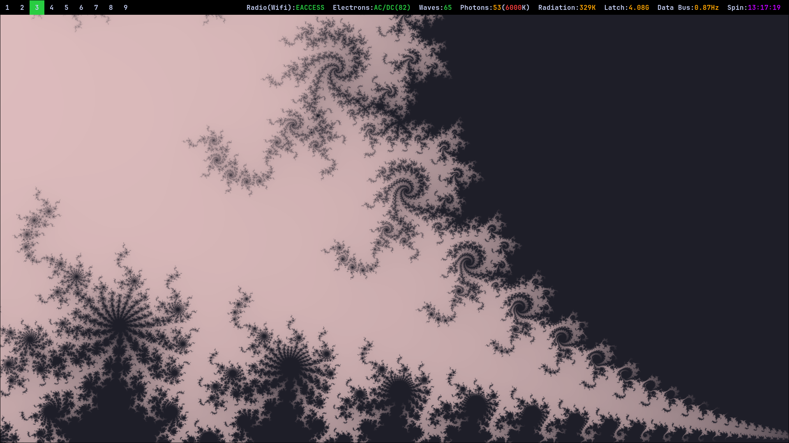

<h1 align="center">
  <br>
    Pegasus Config
  <br>
</h1>
<h4 align="center">
  A configuration for NixOS + Hyprland<br>
  Minimalistic setup for F1 fans and programmers<br>
  Tmux for terminal sessions
</h4>

<p align="center">
  <a href="#wallpapers">Wallpapers</a> •
  <a href="#installation">Installation</a> •
  <a href="#customization">Customization</a> •
  <a href="#docs">Docs</a>
</p>



## Wallpapers


And more in Wallpapers/

[Credit for F1 wallpapers](https://photos.google.com/share/AF1QipMSCLnAN3FpvqaMdcMQfXJU9tHow9PLA1bm4RaeQhzq6EpmLGDnmq1ht2dNqLwODg?pli=1&key=N0xtODRJMHl3cjNwRlVoa2dEanRxZm14TFpBTGpB)

## Installation
Adjust username, hostname and download destination in flake.nix according to your needs<br>
then
```
chmod +x install.sh
./install.sh
```

Then for any changes in nixos/ would require
```
chmod +x nix.sh
./nix.sh
```

## Customization
You can use this project outside of NixOS as well, just by ignoring the nixos directory.<br>
But make sure you download all the dependencies that are used in nixos/desktop-environment.nix<br>
Check ./sync.sh to find where each directory is sourced from

## Docs

### Features
- Ly Display Manager for login
- hyprland as desktop environment
- foot as terminal
- waybar for top bar
- hyprsunset for nightlight
- hyprlock for lock screen
- nvim using NvChad
- tmux
- yazi for file exploring
- wofi for app menu

### Hyprland
Low battery warning notifications
- 30% (Low)
- 15% (Critical)
Change these values in waybar/config\["battery"\]\["states"\] & hypr/battery-notif.sh<br>
<br>
Wallpapers changes every 10 mintues and picks from ~/Pictures/Screenshots

### Waybar


Configure in waybar/config<br>
Styling in waybar/style.css<br>


|Label|Description|
|-|-|
|Radio|Network info, clicking it will open NetworkManager|
|Electrons|Battery %, When charging the % will be wrapped in "AC/DC()", e.g. AC/DC(50)|
|Waves|Volume, clicking it will mute|
|Photons|Brightness %|
|Photons Bracket|Red shift (Night light), 6000 is normal, lower value is redder, higher value is bluer|
|Radiation|CPU Temperature in Kelvin|
|Latch|RAM Usage|
|Data Bus|CPU Speed|
|Spin|Time|

### Keyboard shortcuts
Configure in hypr/hyprland/keybinds.conf

I am left handed so my mouse is in left handed mode<br>
IF YOU ARE NOT LEFT HANDED, change this in hypr/hyprland/input.conf\["input"\]\["left_handed"\]
|Keybind|Description|
|-|-|
|Win + T|**Spawn Terminal** (foot)|
|Win + Q|Kill active window|
|Win + Shift + L|Sign out|
|Win + L|Lock|
|Win + E|Spawn File Explorer (yazi)|
|Win + F|Make active window floating|
|Win + R|**Spawn App Menu** (wofi)|
|Win + P|Pseudo ??? (I don't know what this is used for)|
|Win + J|Toggle window split|
|Ctrl + Shift + Escape|Spawn Task Manager (btop)|
|Win + arrow keys|Move focus of window|
|Win + [1-9]|Switch workspace|
|Win + S|Switch to Special workspace|
|Win + Shift + S|Move current window to Special workspace|
|Win + Ctrl + S|Move current window from Special workspace to current workspace|
|Win + Left click|Resize window|
|Win + Right click|Move window|
|PrintSrc|Take a fullscreen screenshot and save it in ~/Pictures/Screenshots|
|Shift + PrintSrc|Take a partial screen screenshot and save it in ~/Pictures/Screenshots|
|Win + PrintSrc|Take a partial screen screenshot and copy it to clipboard|
|Win + Shift + R|Start/Stop screen recording (without audio)|
|Win + =|Zoom in/out|
|Win + \[|Increase red shift (night light)|
|Win + \]|Decrease red shift|

### Fonts
Jetbrains Mono Nerd Font

### Programming Language setup
Configure in nixos/languages
- Zig
- Elixir & Erlang
- C
- Go
- Javascript & Typescript
- Lua
- Python
- Rust

### Programming Tools
Configure in nixos/environment.nix
- clang-tools
- android-tools
- Vim & Nvim
- git & git-lfs
- nmap
- lazygit
- fzf

### Applications
Configure in nixos/apps.nix
- Vscode
- Discord
- Bitwarden
- Localsend
- Obsidian
- Wine
- Libreoffice
- Dolphin
- Firefox
- VLC
